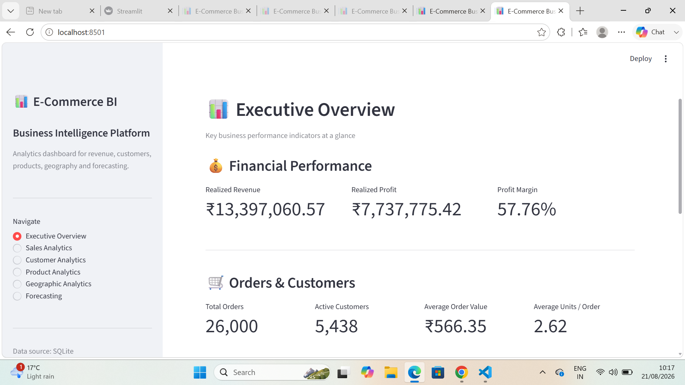
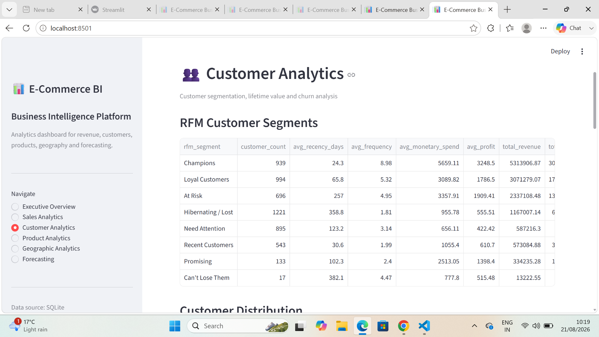
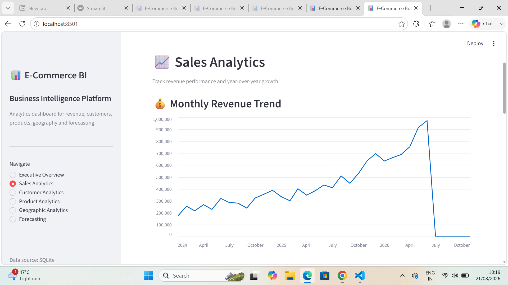
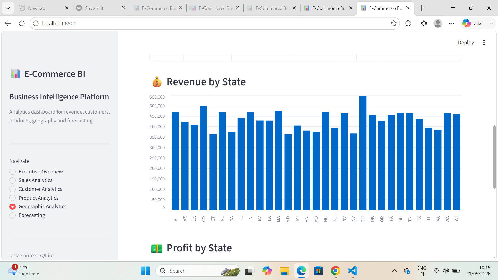
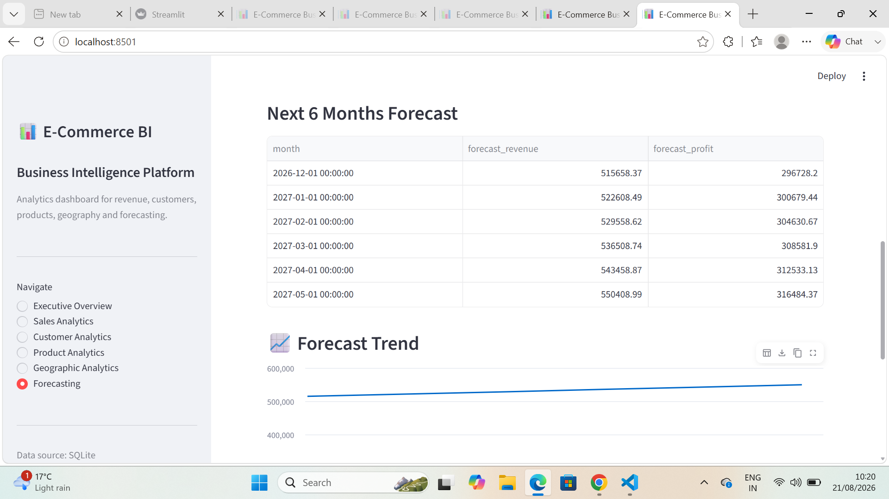

# E-Commerce Business Intelligence Platform

An end-to-end **E-Commerce Business Intelligence and Analytics Platform** built using Python, SQL, SQLite, Pandas, and Streamlit.

The platform transforms e-commerce transaction data into actionable insights covering sales, revenue, customers, products, geography, and forecasting.

---

## 🚀 Project Overview

This project provides an interactive Business Intelligence dashboard for analyzing e-commerce performance.

### Key capabilities

* Executive business KPIs
* Sales and revenue analysis
* Monthly revenue trends
* Year-over-year growth
* Customer RFM segmentation
* Customer Lifetime Value analysis
* Churn-risk analysis
* Product performance analysis
* Category performance analysis
* Geographic/state analysis
* Revenue and profit by state
* Sales forecasting
* Interactive Streamlit dashboard

---

## 🛠️ Technologies Used

* **Python** — Data analysis and processing
* **SQL** — Business analytics
* **SQLite** — Database management
* **Pandas** — Data manipulation
* **NumPy** — Numerical computations
* **Statsmodels** — Sales forecasting
* **Scikit-learn** — Machine learning functionality
* **Streamlit** — Interactive dashboard
* **Matplotlib / Plotly** — Data visualization

---

## 📁 Project Structure

```text
ecommerce-analytics/
│## 📁 Project Structure

ecommerce-analytics/
│
├── dashboard/
│   └── app.py
│
├── data/
│   └── processed/
│       └── cleaned_ecommerce.db
│
├── notebooks/
│   └── E-Commerce_Analytics.ipynb
│
├── reports/
│   └── ...
│
├── sql/
│   └── ...
│
├── src/
│   ├── analysis.py
│   ├── rfm.py
│   ├── forecasting.py
│   ├── sql_runner.py
│   └── verify_db.py
│
├── .gitignore
├── README.md
└── requirements.txt
---

# 📊 Dashboard Modules

## 1. Executive Overview

Provides a high-level summary of business performance.

### KPIs

* Realized Revenue
* Realized Profit
* Profit Margin
* Total Orders
* Active Customers
* Average Order Value
* Average Units per Order
* Fulfillment Rate
* Repeat Purchase Rate
* Fulfilled Orders

### Current Dataset Highlights

| KPI                  |          Value |
| -------------------- | -------------: |
| Realized Revenue     | ₹13,397,060.57 |
| Realized Profit      |  ₹7,737,775.42 |
| Profit Margin        |         57.76% |
| Total Orders         |         26,000 |
| Active Customers     |          5,438 |
| Average Order Value  |        ₹566.35 |
| Fulfillment Rate     |         90.98% |
| Repeat Purchase Rate |         87.57% |
| Fulfilled Orders     |         23,655 |

---

## 2. Sales Analytics

The Sales Analytics module tracks revenue performance over time.

### Includes

* Monthly Revenue Trend
* Monthly Sales Performance
* Total Orders
* Active Customers
* Units Sold
* Gross Revenue
* Discounts
* Net Revenue
* Total Cost
* Net Profit
* Profit Margin
* Average Order Value
* Year-over-Year Revenue Growth

---

## 3. Customer Analytics

Customer behavior is analyzed using **RFM (Recency, Frequency, Monetary) segmentation**.

### Includes

* RFM Customer Segments
* Customer Distribution
* Customer Lifetime Value
* New vs Returning Customers
* Churn Risk Customers

### Customer Segments

* Champions
* Loyal Customers
* Recent Customers
* Promising
* Need Attention
* At Risk
* Hibernating / Lost

---

## 4. Product Analytics

The Product Analytics module evaluates product and category performance.

### Includes

* Category Performance
* Revenue by Category
* Product Performance
* Top Products by Revenue

This helps identify high-performing categories and products.

---

## 5. Geographic Analytics

The Geographic Analytics module evaluates business performance across states.

### Includes

* State Performance
* Total Orders by State
* Unique Customers by State
* Revenue by State
* Profit by State
* Average Order Value by State

This helps identify strong and weak geographic markets.

---

## 6. Sales Forecasting

The forecasting module analyzes historical revenue and generates future sales projections.

### Includes

* Historical Revenue
* Next 6 Months Forecast
* Forecast Trend Visualization

Forecasting can support future sales planning and business decision-making.

---

# 🧠 Analytical Architecture

```text
                 E-Commerce Data
                       │
                       ▼
                SQLite Database
                       │
                       ▼
                 SQL Analytics
                       │
                       ▼
              Python Analytical Layer
                       │
          ┌────────────┼────────────┐
          ▼            ▼            ▼
        Sales          RFM       Forecasting
          │            │            │
          └────────────┼────────────┘
                       ▼
              Streamlit Dashboard
                       │
                       ▼
              Business Intelligence
```

---

# 🗄️ Database

The project uses a SQLite database:

```text
data/processed/cleaned_ecommerce.db
```

The database contains structured e-commerce information including:

* Customers
* Products
* Orders
* Order Items
* Payments

The Python analytical layer queries the database and converts transactional data into business metrics.

---

# ▶️ How to Run the Project

## 1. Open the project

Navigate to the project directory:

```text
ecommerce-analytics
```

## 2. Activate the virtual environment

Windows PowerShell:

```powershell
.\.venv\Scripts\Activate.ps1
```

## 3. Run the analytical modules

Run the main analytics module:

```powershell
python src/analysis.py
```

Run customer RFM analysis:

```powershell
python src/rfm.py
```

Run sales forecasting:

```powershell
python src/forecasting.py
```

## 4. Check dashboard syntax

```powershell
python -m py_compile dashboard/app.py
```

If there is no error message, the dashboard code has compiled successfully.

## 5. Start Streamlit

```powershell
python -m streamlit run dashboard/app.py
```

The dashboard will be available at:

```text
http://localhost:8501
```

---

# 📈 Business Questions Answered

The platform helps answer questions such as:

* How much revenue is the business generating?
* What is the current profit margin?
* Which months generate the most revenue?
* Is revenue growing year over year?
* Which product categories perform best?
* Which products generate the highest revenue?
* Who are the most valuable customers?
* Which customers are at risk of churn?
* How many customers are repeat buyers?
* Which states generate the most revenue?
* Which states generate the highest profit?
* What could future sales look like?

---

# 💡 Business Value

The platform can help businesses:

* Monitor financial performance
* Identify revenue trends
* Improve customer retention
* Identify valuable customer segments
* Detect churn-risk customers
* Optimize product portfolios
* Compare geographic markets
* Support sales planning
* Make data-driven decisions

---

# 🔮 Future Improvements

Possible future enhancements include:

* Interactive date filters
* Category and state filters
* Automated dashboard refresh
* Advanced forecasting models
* Machine-learning churn prediction
* Product recommendation system
* Inventory analytics
* Automated Excel/PDF reports
* Cloud deployment
* User authentication
* Role-based dashboards

---

# 👩‍💻 Author

**Kashish Sharma**

Computer Science & Engineering Graduate

### Areas of Interest

* Data Analytics
* Business Intelligence
* Python
* SQL
* Data Visualization
* Machine Learning

---

# ⭐ Project Highlights

**E-Commerce Business Intelligence Platform**

**Python • SQL • SQLite • Pandas • Streamlit • RFM • Forecasting**

An end-to-end analytics platform that transforms e-commerce transaction data into actionable business insights.
---

# 📊 Dashboard Screenshots

## Executive Dashboard



## Customer Segmentation



## Sales Forecast



## Dashboard View



## Dashboard View

